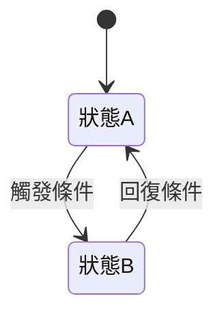

---
id:                # Jira ticket ID，例：VIPOP-44376
title:             # 一行摘要
scope:             # patch | feature | removal | tracking
type:              # content | interaction | permission | ga | layout | mixed
source:            # jira | prd | slack | meeting
created:           # YYYY-MM-DD
deadline:          # YYYY-MM-DD（選填，有排程才填）
related:           # 關聯 ticket，例：[VIPOP-44300, VIPOP-44301]
----------------------------------------------------------------

## 1. 影響範圍

### 受影響的角色

<!-- 列出所有受影響的角色及影響方式 -->

<!--
| 角色         | 影響方式                         |
| ------------ | -------------------------------- |
| 未登入訪客   | 看不到此功能入口                 |
| 免費企業用戶 | 看到功能入口但無法使用，引導升級 |
| VIP 企業用戶 | 完整使用                         |
| 獵頭、派遣身份用戶 | 看不到此功能入口                          |
-->

### 受影響的頁面 / 功能

<!-- 列出頁面名稱、用戶可見的 URL、異動類型 -->
<!-- 如果規格書中有提供頁面路徑再填寫即可，若無請填寫‘--’ -->

<!--
| 頁面名稱 | 頁面路徑 | 異動類型 |
|---------|---------|---------|
| | | 新增 / 修改 / 移除 |
-->

## 2. 權限設計

<!-- 定義各角色在本功能中的權限層級 -->

<!--
### 角色權限矩陣

| 角色 | 進入頁面 | 使用功能 | 查看資料 | 操作資料 | 未滿足時行為 |
|------|:-------:|:-------:|:-------:|:-------:|------------|
| 未登入 | ❌ | ❌ | ❌ | ❌ | 導向登入頁 |
| 獵派公司| ✅ | ❌ | 部分 | ❌ | 隱藏功能按鈕 |
| Web、純刊登公司| ✅ | ❌ | ❌ | ❌ | 隱藏功能按鈕 |
| 一般公司| ✅ | ❌ | 部分 | ❌ | 顯示tooltip升級引導 |
| ATS 用戶 | ✅ | ✅ | ✅ | ✅ | - |

### 權限檢查時機

| 檢查點 | 檢查內容 | 不通過時行為 |
|--------|---------|------------|
| 進入頁面 | 是否登入 | 導向登入頁，登入後跳回 |
| 執行功能 | 是否 VIP | 顯示升級引導 Modal |
| 操作資料 | 是否有足夠點數 | 顯示儲值引導 Modal |
| 操作途中 | 登入是否過期 | 彈出重新登入提示，保留操作狀態 |
-->

## 3. 版面異動

<!-- 移動版面 -->

<!--
**頁面**：{頁面名稱}（{頁面路徑}）

| 區域 | 現行內容 | 改為 | 備註 |
|------|---------|------|------|
| | | | |

**版面調整**：
- 將 {A 區塊} 從 {位置 1} 移至 {位置 2}
- 移除 {某區塊}
- 新增 {某區塊} 於 {位置}

**響應式差異**：
| 裝置 | 差異說明 |
|------|---------|
| Desktop | |
| Tablet | |
| Mobile | |
-->

## 4. 操作流程

<!-- 互動變更、商務模式調整、專案需求 -->

<!--
**現行流程**：
1. 用戶進入 {頁面}（{頁面路徑}）
2. {互動}
3. {系統回應}
4. {結果}

**調整後流程**：
1. 用戶進入 {頁面}（{頁面路徑}）
2. {互動}
3. {系統回應}
4. {結果}

**流程圖**：
-->

## 5. 提示與文案

<!-- 動線中出現的 Modal / Toast / 提示訊息 -->

<!--
#### {提示名稱}（Modal / Toast / Banner / Tooltip，若不知道該屬於哪個分類可以不填括號內容）

| 屬性 | 內容 |
|------|------|
| 標題 | |
| 內容 | |
| 主要按鈕 | {文字} → {按下後行為} |
| 次要按鈕 | {文字} → {按下後行為} |
| 觸發時機 | {什麼情況下出現} |
| 可否關閉 | 點遮罩關閉 / ESC 關閉 / 僅按鈕關閉 |
| 顯示頻率 | 每次都顯示 / 每日一次 / 僅首次 |
-->

## 6. 商業規則

<!-- 商務模式調整 -->

<!--
| 用戶身份 | 狀態條件 | 看到什麼 | 可以做什麼 | 不可以做什麼 |
|---------|---------|---------|-----------|------------|
| 未登入 | - | | | |
| 免費用戶 | - | | | |
| 付費用戶 | 點數足夠 | | | |
| 付費用戶 | 點數不足 | | | |

**計費規則**：
- {描述扣點/收費邏輯}
- {例外情況}
- {退款/撤銷規則}

**額度規則**：
- 每日上限：
- 每月上限：
- 超額處理：
-->

## 7. 狀態變化

<!-- 涉及狀態切換時（免費→付費、可看→不可看、啟用→停用） -->

<!--
| 原始狀態 | 觸發條件 | 新狀態 | 用戶看到的變化 | 可逆？ |
|---------|---------|--------|-------------|-------|
| | | | | |

**狀態圖**：
-->

## 8. 功能移除

<!-- 移除某功能 -->

<!--
**移除什麼**：{用用戶角度描述}

**移除後用戶體驗**：
- 原本有 {功能} 的位置 → {移除後顯示什麼？留白？替代內容？}
- 原本透過 {入口} 進入的用戶 → {導向哪裡？}
- 已收藏/加入書籤的用戶 → {看到什麼？}

**資料處理**：
- 既有資料是否保留？
- 是否需要遷移？
- 是否需要通知用戶？
-->

## 9. 頁面結構

<!-- 專案需求的新頁面 -->

<!--
**頁面**：{頁面名稱}
**網址**：{預期的 URL path}
**誰可以進入**：{權限描述}
**進不去的人看到什麼**：{無權限畫面描述}

**頁面區塊**：
1. {區塊名稱} — {功能描述}
2. {區塊名稱} — {功能描述}
3. ...

**頁面狀態**：
| 狀態 | 顯示內容 |
|------|---------|
| 載入中 | |
| 有資料 | |
| 無資料（空狀態） | |
| 錯誤 | |

**設計稿**：
[{頁面}設計稿]（設計稿連結）

**SEO**：
| 屬性 | 值 |
|------|-----|
| title | |
| description | |
| og:image | |
| 是否需要 SSR | |
-->

## 10. 表單

<!-- 新頁面的輸入表單 -->

<!--
**表單名稱**：{名稱}
**用途**：{這個表單要完成什麼事}

#### 欄位定義

| 欄位名稱 | 欄位類型 | 必填 | 預設值 | 備註 |
|---------|---------|:----:|-------|------|
| | | | | |

#### 輸入驗證

| 欄位名稱 | 驗證規則 | 錯誤提示 | 驗證時機 |
|---------|---------|---------|---------|
| | 必填 | 「請輸入{欄位名}」 | blur / submit |
| | 最少 N 字 | 「至少輸入 N 個字」 | blur / submit |
| | 最多 N 字 | 「不可超過 N 個字」 | 即時（輸入時） |
| | 格式限制（正則） | 「格式不正確」 | blur |
| | 自訂規則 | | |

#### 輸入處理

| 輸入情境 | 處理方式 |
|---------|---------|
| 前後空白 | 自動 trim / 保留 |
| 連續空白 | 壓縮為單一空白 / 保留 |
| HTML 標籤 | 移除（strip tags）/ 轉義（escape）/ 保留 |
| Script / XSS | 移除 |
| Emoji 表情符號 | 允許 / 移除 / 顯示但不送出 |
| 特殊符號（<>'"&） | 允許 / 移除 / 轉義 |
| 換行符號 | 允許 / 轉為空白 / 移除 |
| 複製貼上含格式文字 | 僅保留純文字 / 保留格式 |
| 超過字數上限 | 截斷不讓輸入 / 允許輸入但送出時報錯 |
| 純空白送出 | 視為未填，觸發必填驗證 |

#### 欄位間連動

- 當 {欄位A} 選擇 {值} 時，{欄位B} {行為}

#### 送出行為

- Loading 狀態：{按鈕 disabled + spinner / 全頁 loading}
- 成功 → {用戶看到什麼}
- 失敗 → {用戶看到什麼}
- 重複送出防護：{按鈕 disabled / debounce / 前一次完成前不可再送}
- 送出快捷鍵：{Enter / Ctrl+Enter / 無}

#### 草稿 / 暫存

- 是否需要自動儲存？
- 離開頁面時是否提示未儲存？
-->

## 11. 列表 / 搜尋結果

<!-- 有列表或搜尋結果的頁面 -->

<!--
**資料來源**：{描述}
**預設排序**：{規則}
**每頁筆數**：{數量}
**分頁方式**：傳統分頁 / 無限捲動 / 載入更多按鈕

**篩選條件**：
| 篩選項 | 類型 | 選項來源 | 預設值 | 可複選 |
|--------|------|---------|-------|:-----:|
| | | | | |

**排序選項**：
| 排序項 | 預設方向 |
|--------|---------|
| | 升冪 / 降冪 |

**單筆資料顯示**：
| 欄位 | 顯示規則 | 備註 |
|------|---------|------|
| | | |

**空狀態**：{無搜尋結果時顯示什麼}
**載入狀態**：{搜尋中顯示什麼}
-->

## 12. 追蹤埋點

<!-- GA / NCC 追蹤 -->

<!--
**追蹤目的**：{為什麼要追蹤？要分析什麼？}

| 觸發時機 | 事件名稱 | 攜帶參數 | 追蹤目的 |
|---------|---------|---------|---------|
| | | | |

**轉換漏斗**（選填）：
1. {步驟 1} → 追蹤事件：{event}
2. {步驟 2} → 追蹤事件：{event}
3. {步驟 3} → 追蹤事件：{event}
-->

## 13. 通知 / 信件

<!-- 有觸發通知、Email、站內信等需求時填 -->

<!--
| 觸發時機 | 通知類型 | 對象 | 內容摘要 | 頻率限制 |
|---------|---------|------|---------|---------|
| | Email / 站內信 / Push | | | |
-->

## 14. 既有頁面調整

<!-- 專案需求中涉及的舊頁面調整 -->

<!--
**頁面**：{頁面名稱}（{頁面路徑}）
**調整原因**：{為什麼舊頁面也要動}
**設計稿**：{Figma 連結}

{用上方適合的格式描述改動內容}
-->

## 15. 錯誤處理

<!-- 定義各種錯誤情境下用戶看到什麼 -->

<!--
### 頁面層級錯誤

| 錯誤情境 | 用戶看到什麼 | 用戶可以做什麼 |
|---------|------------|-------------|
| 頁面載入失敗 | 錯誤頁面 + 重試按鈕 | 重試 / 回首頁 |
| 無權限進入 | 403 提示 + 引導 | 返回 / 登入 / 升級 |
| 頁面不存在 | 404 頁面 | 回首頁 |

### 操作層級錯誤

| 操作 | 錯誤情境 | 錯誤提示（文案） | 提示方式 | 用戶可以做什麼 |
|------|---------|---------------|---------|-------------|
| {操作名稱} | API 回應 5xx | 「系統忙碌中，請稍後再試」 | Toast / Modal | 重試 |
| {操作名稱} | API 回應逾時 | 「連線逾時，請檢查網路後重試」 | Toast | 重試 |
| {操作名稱} | 網路斷線 | 「網路連線中斷，請檢查網路設定」 | Banner（頂部） | 恢復網路後自動重試 / 手動重試 |
| {操作名稱} | 業務邏輯錯誤（如餘額不足） | {具體文案} | Modal | {具體行為} |
| {操作名稱} | 登入過期 | 「登入已過期，請重新登入」 | Modal（不可關閉） | 重新登入，登入後回到原頁面 |

### 表單驗證錯誤

| 錯誤類型 | 顯示位置 | 顯示時機 | 清除時機 |
|---------|---------|---------|---------|
| 單一欄位驗證失敗 | 欄位下方（inline） | blur / submit | 用戶開始重新輸入時 |
| 多欄位聯合驗證失敗 | 表單頂部（summary） | submit | 任一相關欄位修改時 |
| API 回傳的欄位錯誤 | 對應欄位下方 | API 回應後 | 用戶開始重新輸入時 |
| API 回傳的通用錯誤 | Toast / Modal | API 回應後 | 自動消失 / 用戶關閉 |

### 錯誤恢復策略

| 情境 | 恢復方式 |
|------|---------|
| 用戶填了很長的表單，送出失敗 | 保留已填內容，不清空表單 |
| 操作到一半頁面意外重整 | {是否有暫存機制} |
| 扣點成功但後續操作失敗 | {是否退點 / 如何補救} |
-->

## 16. 例外情境

<!-- AI 應主動補充極端操作與邊界情況 -->

<!-- 人工撰寫時也應思考以下面向 -->

<!--
| # | 情境分類 | 情境描述 | 預期行為 |
|---|---------|---------|---------|
| 1 | 操作類 | 用戶連續快速點擊送出按鈕 | |
| 2 | 操作類 | 同時開多個分頁操作同一功能 | |
| 3 | 操作類 | 瀏覽器上一頁/下一頁 | |
| 4 | 操作類 | 用戶在操作途中登入過期 | |
| 5 | 網路類 | 網路斷線或逾時 | |
| 6 | 網路類 | API 回應異常（5xx / 非 JSON） | |
| 7 | 資料類 | 資料量為 0（空狀態） | |
| 8 | 資料類 | 資料量極大（效能邊界） | |
| 9 | 資料類 | 資料在操作途中被他人異動 | |
| 10 | 輸入類 | 特殊字元或超長文字輸入 | |
| 11 | 輸入類 | 複製貼上含格式文字 / HTML | |
| 12 | 裝置類 | 手機端鍵盤彈出導致版面位移 | |
| 13 | 裝置類 | 不同瀏覽器的相容性 | |
| 14 | 權限類 | 操作到一半權限被降級 | |
| 15 | 併發類 | 多人同時操作同一筆資料 | |
-->

