# VIPOP-45176 Axure 規格書內容

> 來源：https://ng0704.axshare.com
> 專案名稱：刊登漲價調整
> 讀取日期：2026-05-19

---

## 1. 需求來源&專案資料

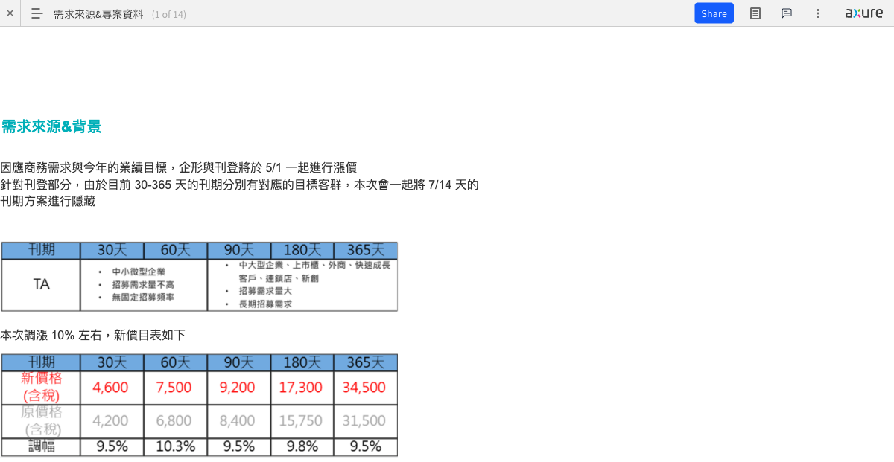

### 背景說明

因應商務需求與今年的業績目標，企形與刊登將於 5/1 一起進行漲價。

針對刊登部分，由於目前 30-365 天的刊期分別有對應的目標客群，本次會一起將 **7/14 天的刊期方案進行隱藏**。

### 需求來源&背景

本次調漲 10% 左右，新價目表如下（詳見 Axure 圖片）。

### 上線時間

**2026/04/30 20:00**

已於業務團隊協調，當天 20:00-24:00 會封網進，避免新舊價格並存問題。

### 完整設計稿連結

- 未登設計稿（連結於 Axure 內）
- 已登設計稿（連結於 Axure 內）
- 合約書設計稿（連結於 Axure 內）

---

## 2. 未登頁調整（父層概述）

此層為分類資料夾，涵蓋以下子頁面：
- /preLogin/
- /pre-search/search-result/jobcat/
- /preLogin/program
- /preLogin/register
- /preLogin/contactus
- /preLogin/contract
- 未登刊登建議

（各子頁面詳見以下各節）

---

## 3. /preLogin/

**URL**：https://vip.104.com.tw/preLogin/

設計稿：見 Axure 連結

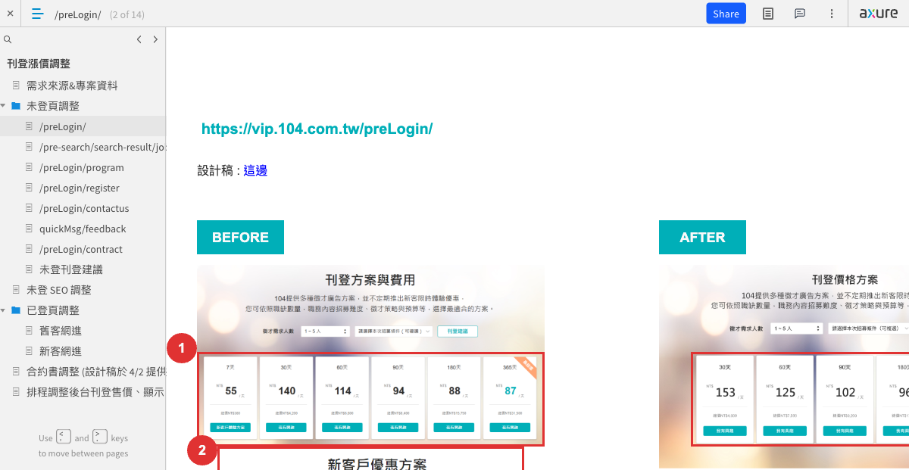

### 調整內容

| # | 調整內容 |
|---|---------|
| 1 | 調整價目表，移除 7 天卡片、其餘天數調整價格（修改後的價格如下表） |
| 2 | 修改文案：**新客戶專屬！解鎖限時刊登優惠**、**立即填表，索取最新徵才服務** |
| 3 | 修改文案，移除 7、14 天方案；各方案費用如下 |

### 新價目表

| 刊期 | 總價 | 日均價 |
|------|------|--------|
| 30 天 | NT$4,600 | 153 |
| 60 天 | NT$7,500 | 125 |
| 90 天 | NT$9,200 | 102 |
| 180 天 | NT$17,300 | 96 |
| 365 天 | NT$34,500 | 95 |

### BEFORE / AFTER

頁面包含 BEFORE（調整前）與 AFTER（調整後）對照圖，調整標記點：1、2、3。

---

## 4. /pre-search/search-result/jobcat/

**URL**：https://vip.104.com.tw/pre-search/search-result/jobcat/[類目id]

設計稿：見 Axure 連結

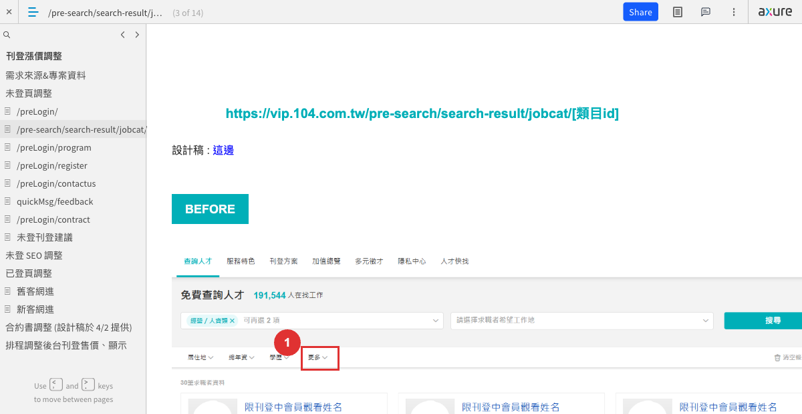

### 調整內容

| # | 調整內容 |
|---|---------|
| 1 | 「更多」改為「解鎖更多篩選條件 立即加入「新客戶優惠方案」」；新客戶優惠方案連結導往 https://vip.104.com.tw/preLogin/contactUs |

### BEFORE / AFTER

頁面包含 BEFORE 與 AFTER 對照圖，調整標記點：1（出現 3 組，對應不同裝置或版面）。

---

## 5. /preLogin/program

**URL**：https://vip.104.com.tw/preLogin/program

設計稿：見 Axure 連結

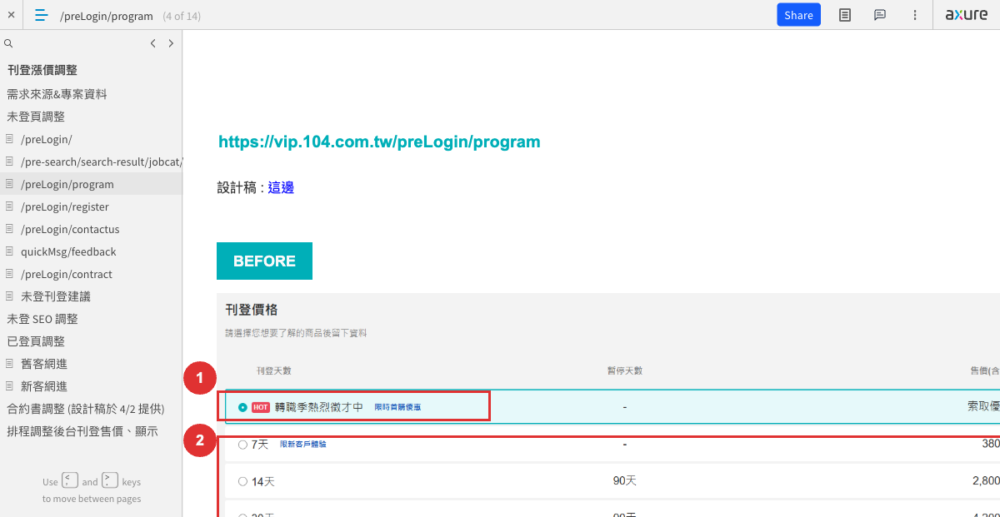

### 調整內容

| # | 調整內容 |
|---|---------|
| 1 | 修改文案：**新客戶專屬優惠**、**首購優惠詳情**（連結不變，只改文案） |
| 2 | 價格表移除 7、14 天方案；其餘天數調整售價（售價如下表） |

### 新售價表

| 刊期 | 售價 |
|------|------|
| 30 天 | 4,600 |
| 60 天 | 7,500 |
| 90 天 | 9,200 |
| 180 天 | 17,300 |
| 365 天 | 34,500 |

### BEFORE / AFTER

頁面包含 BEFORE 與 AFTER 對照圖，調整標記點：1、2。

---

## 6. /preLogin/register

**URL**：https://vip.104.com.tw/preLogin/register

設計稿：見 Axure 連結

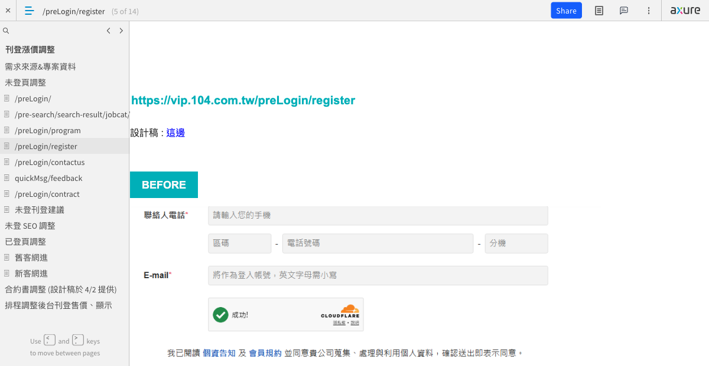

### 調整內容

| # | 調整內容 |
|---|---------|
| 1 | 修改文案：**新客戶專屬優惠**、**立即刊登，解鎖限時優惠** |

### BEFORE / AFTER

頁面包含 BEFORE 與 AFTER 對照圖，調整標記點：1。

---

## 7. /preLogin/contactus

**URL**：https://vip.104.com.tw/preLogin/contactUs

設計稿：見 Axure 連結

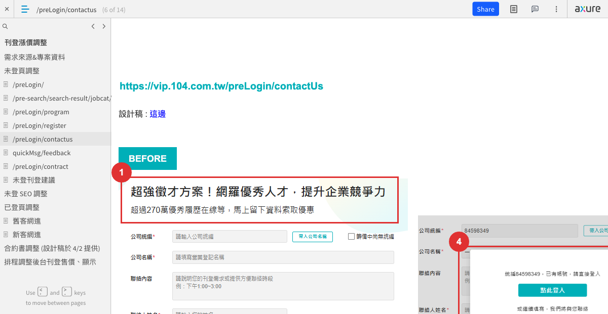

### 調整內容

| # | 調整內容 |
|---|---------|
| 1 | 修改文案：**新客戶專屬！解鎖限時刊登優惠**、**立即填表，索取最新徵才服務** |
| 2 | 修改文案：**新客戶專屬優惠**、**立即刊登，解鎖限時優惠** |
| 3 | 移除電話區塊 |
| 4 | 輸入既有統編跳出的圖層，調整下半部文案＆按鈕位置：「或繼續填寫，我們將與您聯絡」；說明文字：「已在104刊登過，將不再提供新客戶專屬優惠」 |
| 5 | contact number 原先預設帶入 101（七天體驗），因目前不賣七天方案了，後續預設改帶 **201（請與我聯絡）** |

### BEFORE / AFTER

頁面包含 BEFORE 與 AFTER 對照圖，調整標記點：1、2、3、4。

---

## 8. /preLogin/contract

**URL**：https://vip.104.com.tw/preLogin/contract

設計稿：見 Axure 連結

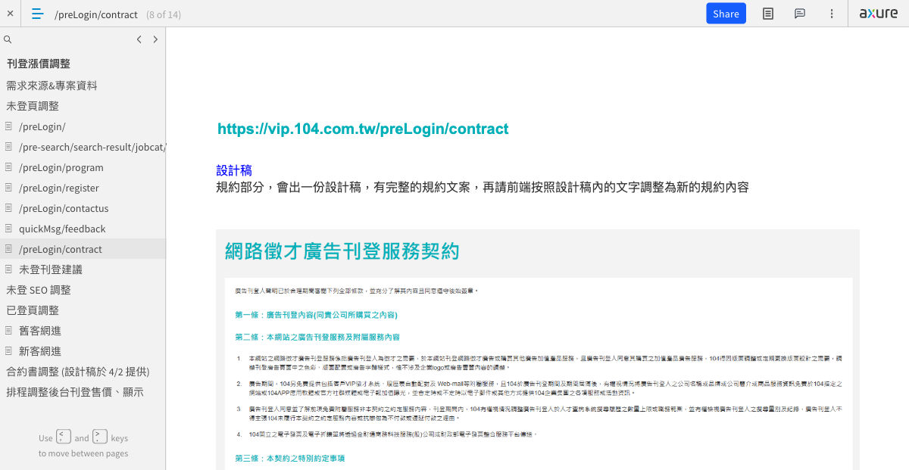

### 調整內容

規約部分，會出一份設計稿，有完整的規約文案，再請前端按照設計稿內的文字調整為新的規約內容。

---

## 9. 未登刊登建議

**頁面**：
- https://vip.104.com.tw/preLogin/（底部的刊登方案建議）
- https://vip.104.com.tw/preLogin/program（上方的刊登方案建議）

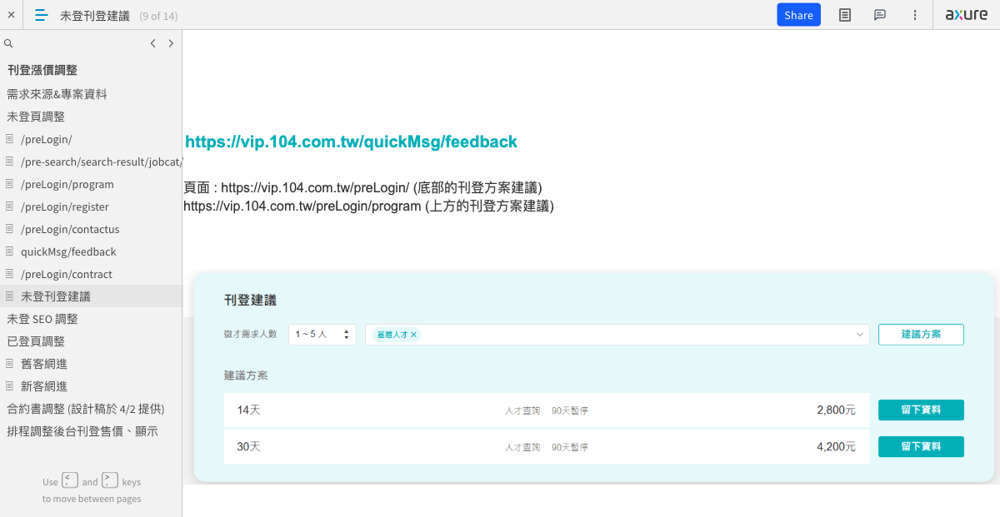

### 規格調整

因後續會取消 7/14 天的標準刊期，規則調整如下：

- **僅調整基層人才 ×1-5 人，改建議 30 天**
- 其餘組合不變

---

## 10. 未登 SEO 調整

此部分規格由 **Aco** 協助，如有問題可先找 **sam.wang** 討論。

目標：**把 7 天相關的文字移除 & 更新部分頁面 og 圖**

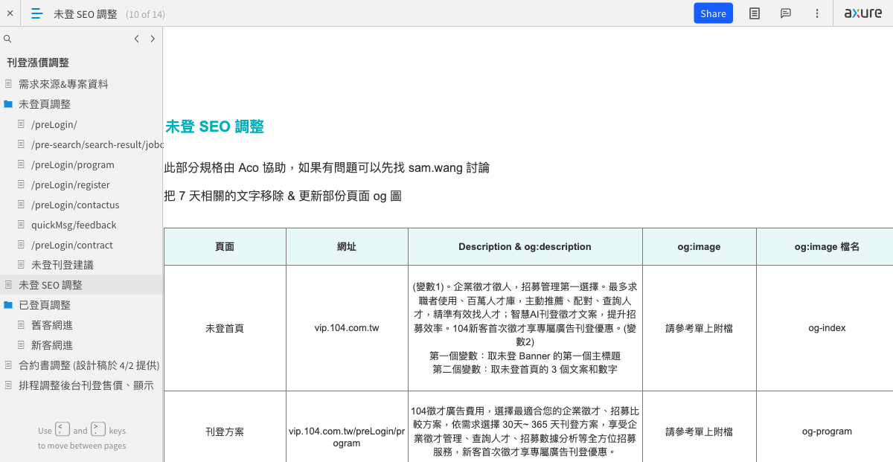

### SEO 調整明細表

| 頁面 | 網址 | Description & og:description | og:image | og:image 檔名 |
|------|------|-------------------------------|----------|--------------|
| 未登首頁 | vip.104.com.tw | （變數1）。企業徵才徵人，招募管理第一選擇。最多求職者使用、百萬人才庫，主動推薦、配對、查詢人才，精準有效找人才；智慧AI刊登徵才文案，提升招募效率。104新客首次徵才享專屬廣告刊登優惠。（變數2）。第一個變數：取未登 Banner 的第一個主標題；第二個變數：取未登首頁的 3 個文案和數字 | 請參考單上附檔 | og-index |
| 刊登方案 | vip.104.com.tw/preLogin/program | 104徵才廣告費用，選擇最適合您的企業徵才、招募比較方案，依需求選擇 30天~ 365 天刊登方案，享受企業徵才管理、查詢人才、招募數據分析等全方位招募服務，新客首次徵才享專屬廣告刊登優惠。 | 請參考單上附檔 | og-program |
| 服務特色 | vip.104.com.tw/preLogin/features | 104企業徵才、徵人、招募人才，104提供刊登評估、智慧刊登、招募建議、性格常模、百萬人才查詢、圖文廣告內容、刊登暫停功能、智慧推薦履歷、APP免費連絡求職者。104新客首次徵才享專屬廣告刊登優惠。 | （無更新）| （無）|
| 新客體驗 | vip.104.com.tw/preLogin/customerTrial | **5/1 先隱藏頁面**（Aco 用 GTM 轉址處理） | — | — |
| 新客表單 | vip.104.com.tw/preLogin/contactUs | — | — | — |
| 網進表單 | vip.104.com.tw/preLogin/register | 104招募管理全台最多企業愛用的徵才人力銀行，近50萬間企業青睞。104徵才提供CP值最高的服務，用最短時間幫您找到人才！新客首次徵才享專案優惠，立即刊登解鎖優惠價格。 | — | — |
| 人才快找 | vip.104.com.tw/preLogin/appIntro | — | 請參考單上附檔 | og-app-intro |
| 意見回饋 | vip.104.com.tw/quickMsg/feedback | — | — | — |
| 查詢人才 | vip.104.com.tw/pre-search/ | 徵才招募先來104免費查詢符合人才，百萬人才庫可依工作地點、職務類別、學經歷等免費搜尋。104人力銀行網路徵才廣告方案，新客首次徵才享專屬廣告刊登優惠。 | 請參考單上附檔 | og-pre-search |
| 服務契約 | vip.104.com.tw/preLogin/contract | 企業徵才、徵人、招募人才，人力銀行第一選擇，提供百萬人才查詢、刊登徵才職缺、接收求職者應徵履歷、專人客服諮詢。104新客首次徵才享專屬廣告刊登優惠。 | — | — |
| 加值總覽 | — | — | 請參考單上附檔 | og-add-list |

---

## 11. 已登頁調整（父層概述）

此層為分類資料夾，涵蓋以下子頁面：
- 舊客網進
- 新客網進

（各子頁面詳見以下各節）

---

## 12. 舊客網進

設計稿：見 Axure 連結

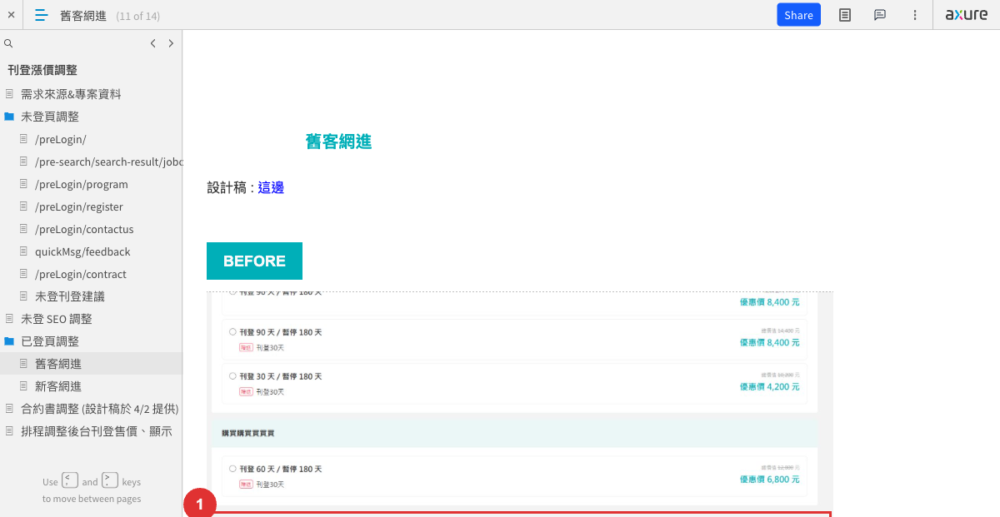

### 調整內容

| # | 調整內容 |
|---|---------|
| 1 | 移除 14 天卡片，剩餘卡片調整寬度（這邊價格是抓後台的，所以價格應該不用前端調整） |

### 新價目表（供參考）

| 刊期 | 總價 | 日均價 |
|------|------|--------|
| 30 天 | 4,600 | 153 |
| 60 天 | 7,500 | 125 |
| 90 天 | 9,200 | 102 |
| 180 天 | 17,300 | 96 |
| 365 天 | 34,500 | 95 |

### BEFORE / AFTER

頁面包含 BEFORE 與 AFTER 對照圖，調整標記點：1。

---

## 13. 新客網進

設計稿：見 Axure 連結

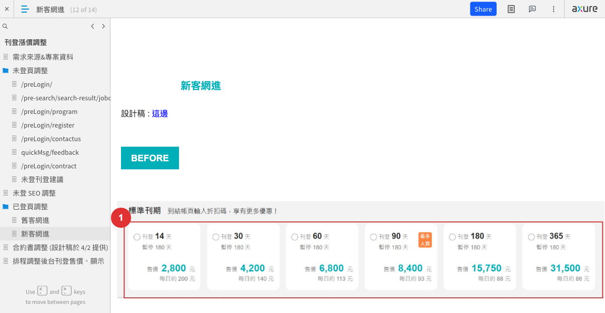

### 調整內容

| # | 調整內容 |
|---|---------|
| 1 | 移除 14 天卡片，剩餘卡片調整寬度（這邊價格是抓後台的，所以價格應該不用前端調整） |

### 新價目表（供參考）

| 刊期 | 總價 | 日均價 |
|------|------|--------|
| 30 天 | 4,600 | 153 |
| 60 天 | 7,500 | 125 |
| 90 天 | 9,200 | 102 |
| 180 天 | 17,300 | 96 |
| 365 天 | 34,500 | 95 |

### BEFORE / AFTER

頁面包含 BEFORE 與 AFTER 對照圖，調整標記點：1。

---

## 14. 合約書調整

設計稿：見 Axure 連結（設計稿於 4/2 提供）

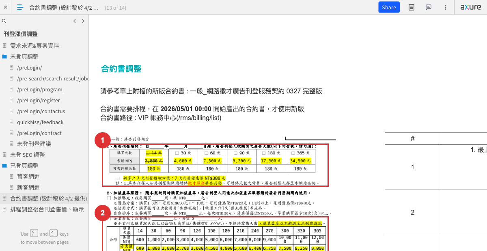

### 說明

- 請參考單上附檔的新版合約書：**一般_網路徵才廣告刊登服務契約 0327 完整版**
- 合約書需要排程，在 **2026/05/01 00:00** 開始產出的合約書，才使用新版
- 合約書路徑：VIP 帳務中心（/rms/billing/list）

### 調整內容明細

| # | 調整內容 |
|---|---------|
| 1 | **刊期調整**：最上方廣告刊登期間說明（自年月日起，廣告刊登人欲購買之廣告天數，此行為粗體）；移除 14 天，並調整其餘天數價格；移除七天方案；廣告刊登改為「徵才服務」 |
| 2 | **企形部分**：移除優惠價整列（已於 VIPOP-43456 實作） |
| 3 | **第二條第二點**，調整內容完整如下：廣告期間，104另免費提供包括104招募管理（104VIP）、履歷表自動配對等附屬服務，且104於廣告刊登期間及期間屆滿後，有權視情況將廣告刊登人之公司名稱或品牌或公司簡介或商品服務資訊免費於104指定之網站或104APP應用軟體或官方社群媒體或電子報加值曝光，並會定時或不定時以電子郵件或其他方式提供104企業集團之各項服務或活動資訊。 |
| 4 | **第三條之二**，本來最後一句有下底線，但文字實際不需要下底線 |
| 5 | **第三條之六**，調整內容完整如下：6、廣告刊登人同意於廣告刊登期間內對104提供之求職者履歷資料，依我國個人資料保護法相關規定採取必要之安全維護措施，且僅得於徵才面試之範圍、類別、特定目的內，為蒐集、處理或利用求職者履歷資料。廣告刊登人應防止104VIP專屬帳號密碼外洩，並定期更新密碼及其強度，如遇有第三人之異常登入或使用情形時，應即通報104，並同意104得採取必要合理之防止措施。如經104主動察覺者亦同。 |
| 6 | **第三條之八（新增）**，完整如下（原第八條之後，往後順延一個號碼）：廣告刊登人同意不得將104VIP帳號密碼洩漏、轉借、提供，或直接或間接利用任何第三人之軟體、設備、自動化程式或其他任何方法或手段（包括但不限於爬蟲程式、瀏覽器外掛程式、附加元件或其他任何人工智慧技術）（下稱第三人之自動化方法或手段）自動登入104VIP，或以第三人之自動化方法或手段使第三人得以對104VIP求職者個人資料之全部或一部進行蒐集、處理或利用（包括但不限於第三人大型語言模型LLM之利用）。 |
| 7 | **號碼順延**：因新增第三條之八，此處號碼順延為 9、10、11。**第三條之九**調整文案完整如下（都不需要底線）：除本契約另有約定外，廣告刊登人於廣告刊登期間內，得依其實際需求暫停廣告之刊登（暫停徵才服務期間，廣告刊登人無法使用104VIP的完整服務且對其所獲取之求職者履歷資料之利用，仍須遵守本契約之各項約定），廣告刊登人依其所購買之廣告天數最高得暫停之期間如本契約第一條之附表所載，期間屆滿，本網站系統將自動將廣告刊登人之廣告開啟，廣告刊登人若須中途解約，廣告刊登人同意且了解其刊登費用非依刊登期間等比例計算，係以已刊登逾月、季或半年之刊登費用加畸零天數總合計算。 |
| 8 | （4/23 新增前線需求）**移除發票郵寄地址欄位**（整條移除） |

---

## 15. 排程調整後台刊登售價、顯示

**排程時間**：2026/05/01 00:00

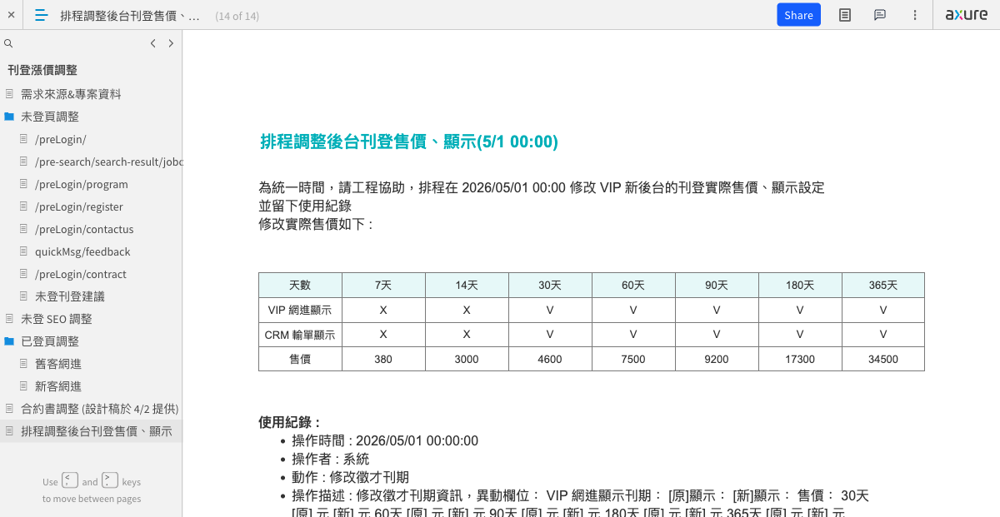

### 說明

為統一時間，請工程協助，排程在 **2026/05/01 00:00** 修改 VIP 新後台的刊登實際售價、顯示設定，並留下使用紀錄。

### 後台刊登顯示設定

| 天數 | VIP 網進顯示 | CRM 輸單顯示 | 售價 |
|------|------------|------------|------|
| 7 天 | X（隱藏） | X（隱藏） | 380 |
| 14 天 | X（隱藏） | X（隱藏） | 3,000 |
| 30 天 | V（顯示） | V（顯示） | 4,600 |
| 60 天 | V（顯示） | V（顯示） | 7,500 |
| 90 天 | V（顯示） | V（顯示） | 9,200 |
| 180 天 | V（顯示） | V（顯示） | 17,300 |
| 365 天 | V（顯示） | V（顯示） | 34,500 |

### 使用紀錄格式（供工程參考）

- **操作時間**：2026/05/01 00:00:00
- **操作者**：系統
- **動作**：修改徵才刊期
- **操作描述**：修改徵才刊期資訊，異動欄位：VIP 網進顯示刊期：[原]顯示：[新]顯示：售價：30天 [原] 元 [新] 元 60天 [原] 元 [新] 元 90天 [原] 元 [新] 元 180天 [原] 元 [新] 元 365天 [原] 元 [新] 元

---

## 附錄：略過的頁面

- **quickMsg/feedback**：依任務指示略過
